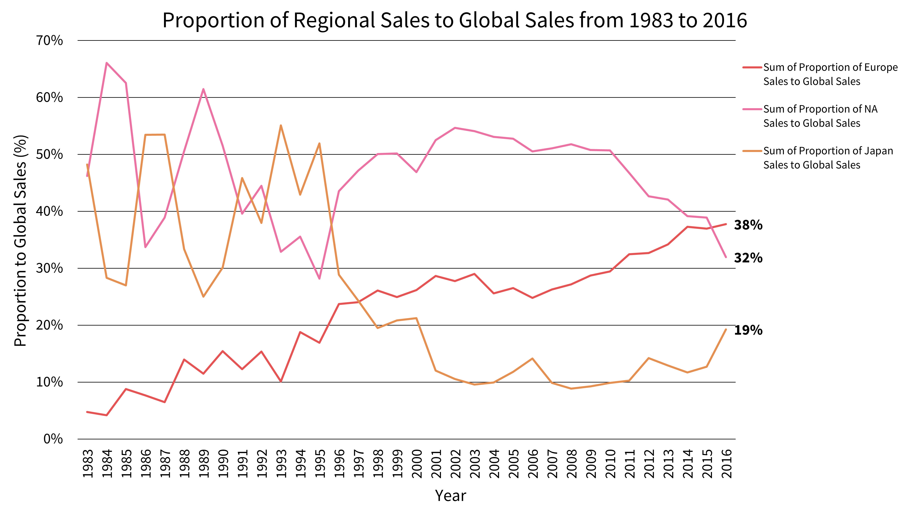
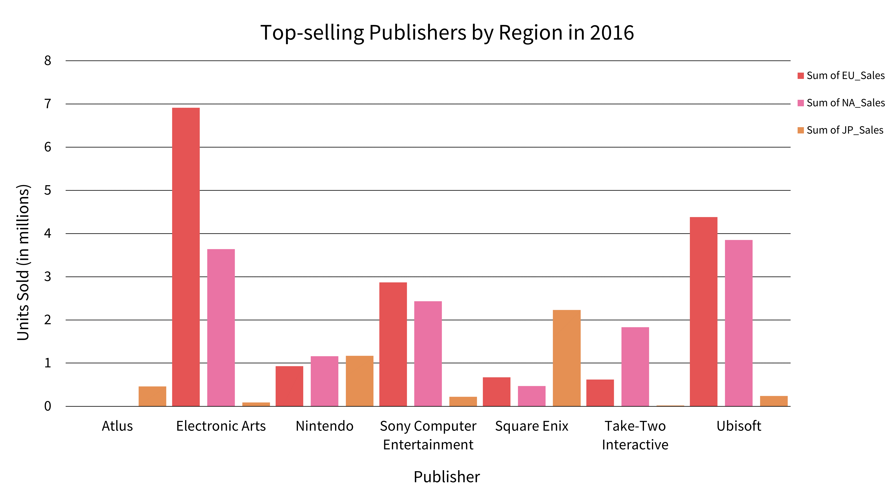

# Market Analysis: Project Overview
## [GameCo 2017 Insights - PowerPoint](https://github.com/ke177409/Market-Analysis/blob/main/GameCo%202017%20Video%20Game%20Insights.pptx)
## Tools & Skills
**Excel**
* Data filtering and sorting
* Grouping and summarizing data
* Descriptive analysis
* PivotTables to create new variables and visualizations.

Video game sales data was analyzed for a new video game company intending to enter the market. The analysis evaluated data from North America, Europe, and Japan from 1983 to 2016. These years were selected due to the availability of data across all three regions.

The stakeholders assume that North America will persist as the largest contributor to the global market, however, a new variable measuring the proportion of regional total sales relative to the global total sales for each year was calculated to more accurately detect each region's contribution to the global market. There is a convergence of sales between North America and Europe in 2015 and Europe emerges as the leader in 2016.

Not only did Europe hold the largest portion of global sales, but it also surpassed North America in the number of units sold.

 
  
  

Shooter genres were the most popular in Europe and North America. Additionally, action genres were popular in all three regions.

In 2016, there was a distinct top-selling video game publisher in each of the three regions:
* **Europe**: Electronic Arts
* **North America**: Ubisoft
* **Japan**: Square Enix

## Recommendations & Findings
* Focus marketing and sales strategies in European markets. This may include tailoring game offerings, marketing campaigns, and distribution strategies to align with European preferences.
* Invest in the development of shooter games to satisfy the larger European and North American markets.
* Maintain a secondary focus on action genres because they have broad appeal across all three regions.
* Conduct further analysis to assess and understand the competing publishing companies in each region.
  
## Data Storytelling
* PowerPoint presentation format
* Deliver insights that challenge stakeholder expectations

## Data Cleaning and Transformation
* Removed duplicate data.
* Removed columns containing irrelevant data.
* Imputed missing regional sales data using averages.
* Removed rows with empty or null values.
* Columns and values were reformatted for consistency.

## Purpose & Context
I was responsible for defining the project’s scope and determining the final presentation format. This project was a part of CareerFoundry’s Data Immersion curriculum and was evaluated by my tutor and mentor.

## The Learning Experience
Data cleansing was the biggest challenge in this project, mostly due to format differences in the video game titles. The line graph displaying the proportion of sales over time was generated with the help of my mentor. This visual challenged my original assumptions and prompted me to look deeper into the data to gain a more accurate understanding of regional market behavior.

## Dataset
*Video game sales* [Data set]. VGChartz. https://github.com/ke177409/Market-Analysis/blob/main/Video%20game%20sales%20data%20set.xlsx

*VGChartz Methodology* (2018). VGChartz. https://www.vgchartz.com/methodology.php
