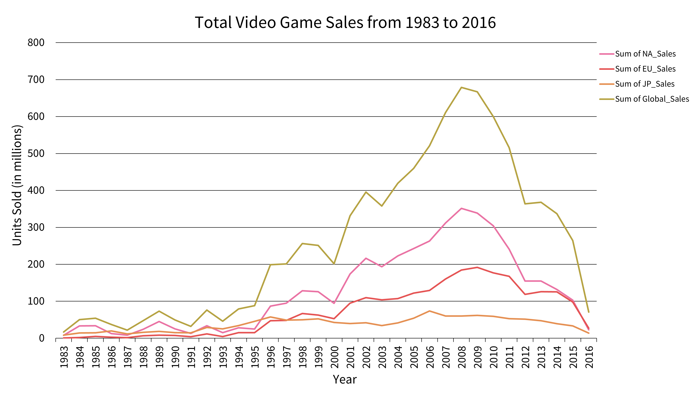

# Market Analysis: Project Overview
Conducted an evaluation of historical international video game sales data trends for a video game company. The analysis revealed significant insights, including the popularity of different game genres, sales performance across various geographic regions, and an assessment of market competitors.

In this analysis, Microsoft Excel was extensively utilized for tasks such as data filtering, sorting, and cleaning, all of which were crucial for ensuring data quality. PivotTables were employed to derive new variables and generate informative data visualizations.

## Tools & Skills
Excel
* Data quality checks
* Grouping and summarizing data
* Descriptive analysis
* PivotTables
  
Data Storytelling
* PowerPoint presentation format
* Deliver insights that challenge stakeholder expectations

## Purpose & Context
As part of CareerFoundry's Data Immersion curriculum, I executed an exploratory analysis to address crucial stakeholder inquiries. My responsibilities encompassed determining the project's scope and selecting the final presentation format. Throughout the project's development, it received evaluation and feedback from both a tutor and a mentor, ensuring a comprehensive and insightful learning experience.

## Data Cleaning and Transformation
* Duplicate entries within the dataset were identified and removed to enhance data accuracy.
* Columns containing irrelevant data, which did not contribute to the analysis, were eliminated to streamline the dataset.
* In columns related to regional sales with partial missing data, averages were imputed to maintain data completeness.
* Rows with empty or null values were excluded from the dataset to ensure data integrity.
* Columns and values were reformatted for consistency, aligning them with a unified data structure.
* Empty values within the dataset were labeled as "N/A" to clearly signify missing or unspecified data points.

## Visualizations

The analysis focused on the evaluation of the top three selling regions, namely North America, Europe, and Japan, spanning the years from 1983 to 2016. These specific years were selected due to the availability of data across all three regions.

To assess and compare the sales performance of these regions, a line graph representing the total units sold was generated. This graph indicated historical trends and insights into the regions' sales dynamics. Over the years, North America emerged as the dominant player in the global market, maintaining its position for an extended period. Consequently, stakeholders have been inclined to assume that North America will persist as the largest contributor to the global market.

Additional observations from the analysis include a notable decline in sales beginning in 2009, which signifies a potential turning point in the industry. Furthermore, the graph revealed a convergence of sales between North America and Europe in 2015, suggesting a shift in the balance of market influence between these regions.

To gain further insights into the behavior of the three regions (North America, Europe, and Japan) over time, a new variable measuring the proportion of regional total sales relative to the global total sales for each year was created. This variable allowed for the assessment of each region's contribution to the global market.

Subsequently, the data representing these proportions was visualized using another line graph. This visualization provided a dynamic representation of how the market share of each region evolved over the years, shedding light on shifts in their relative importance and influence within the global market.

In 2016, Europe emerged as the leader in the global sales landscape. Not only did Europe hold the largest portion of global sales, but it also surpassed North America in the number of units sold.

Shooter genres were the most popular in Europe and North America. Additionally, action genres were popular in all three regions.

 
  
  

In 2016, there was a distinct top-selling video game publisher in each of the three regions:
* **Europe**: Electronic Arts
* **North America**: Ubisoft
* **Japan**: Square Enix

## Recommendations & Findings
* Given that Europe dominates the global market over North America and Japan, it is advisable to prioritize efforts to cater to the European market. This may include tailoring game offerings, marketing campaigns, and distribution strategies to align with European preferences.
* Recognizing the popularity of shooter genres in both Europe and North America, consider investing in the development of shooter games to satisfy the larger European and North American markets. These genres align with the preferences of these regions.
* While shooter games should take precedence in European and North American markets, it's important to maintain a secondary focus on action genres. Action genres have a broad appeal and are popular across all three regions, making them a valuable addition to the game portfolio.
* To gain a competitive edge, conduct further analysis to assess and understand the competing publishing companies in each region. This insight can inform strategies to effectively compete and secure market share.

## The Learning Experience
Data cleansing was the biggest challenge in this project, mostly due to format differences in the video game titles. The line graph displaying the proportion of sales over time was generated with the help of my mentor. This visual challenged my original assumptions and my first line graph showing total count of sales 
over time. This prompted me to look deeper into the data to gain a more accurate understanding of regional market behavior.

## Dataset
*Video game sales* [Data set]. VGChartz. https://github.com/ke177409/Market-Analysis/blob/main/Video%20game%20sales%20data%20set.xlsx

*VGChartz Methodology* (2018). VGChartz. https://www.vgchartz.com/methodology.php
