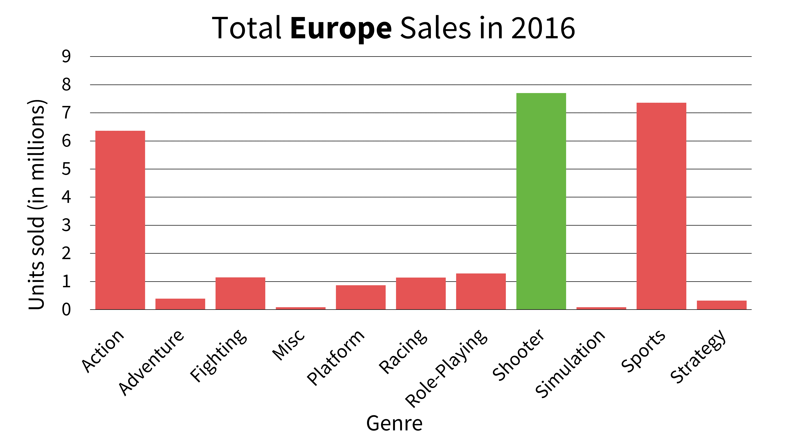

# Market Analysis: Project Overview
Evaluated historical international video game sales data to identify trends in game genre popularity, sales figures for different geographic regions, and market competitors. Findings include regional sales trends, 
proportion of regional sales to global sales, and top-selling video game publishers. Used Excel to filter, sort, and clean data. Generated PivotTables to create new variables and visualizations.

## Tools & Skills
Excel
* Data quality checks
* Descriptive and exploratory analyses
* PivotTables
  
Data Storytelling
* PowerPoint presentation format
* Deliver insights that challenge stakeholder expectations

## Purpose & Context
I performed an exploratory analysis to answer key stakeholder questions. I was responsible for deciding on the project scope and final presentation format. This project was a part of 
CareerFoundry’s Data Immersion curriculum and was evaluated with feedback by a tutor and mentor.

## Data Cleaning and Transformation
* Removed duplicates.
* Removed columns with irrelevant data.
* Imputed averages in columns for regional sales with partially missing data.
* Removed empty rows.
* Reformatted columns and values for consistency.
* Labelled blank values as "N/A".

## Visualizations

This analysis measured the three highest selling regions (North America, Europe, and Japan) in years 1983 to 2016. These years were chosen because data was available for all three regions. 

I created a line graph of total units sold to determine which region had the highest number of sales. Historically, North America has dominated the global market for the longest period. The stakeholders assume 
that North America will continue to hold the largest position in the global market. 

Other observations include a decline in sales beginning in 2009 and a convergance of sales for North America and Europe in 2015.

I created a new variable to measure the proportion of regional total sales by global total sales for each year. This data was plotted on another line graph to visualize the behavior of the three regions over time. 

In 2016, Europe held the largest portion of global sales and surpassed North America in number of units sold.

Shooter genres were the most popular in Europe and North America. Action genres were popular in all three regions.

 
  

In 2016, there was a different top-selling publisher in each region:
* **Europe**: Electronic Arts
* **North America**: Ubisoft
* **Japan**: Square Enix

## Recommendations & Findings
* Europe makes up most of the global market over North America and Japan.
* Develop more Shooter games to satisfy the larger European and North American markets.
* A secondary focus on Action genres to satisfy all three regions.
* Perform further analysis to address competing publishing companies in each region.

## The Learning Experience
Data cleansing was the biggest challenge in this project, mostly due to format differences in the video game titles. The line graph displaying the proportion of sales over time was generated with the help of my mentor. This visual challenged my original assumptions and my first line graph showing total count of sales 
over time. This prompted me to look deeper into the data to gain a more accurate understanding of regional market behavior.

## Dataset
*Video game sales* [Data set]. VGChartz. https://github.com/ke177409/Market-Analysis/blob/main/Video%20game%20sales%20data%20set.xlsx

*VGChartz Methodology* (2018). VGChartz. https://www.vgchartz.com/methodology.php
